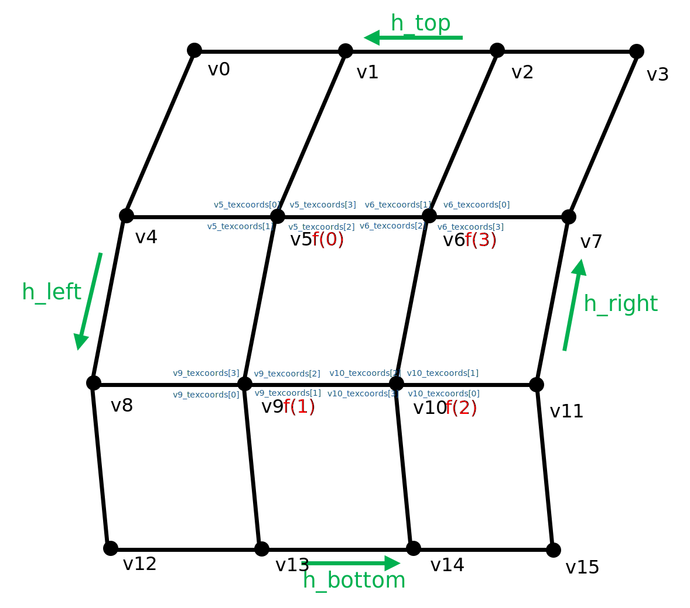
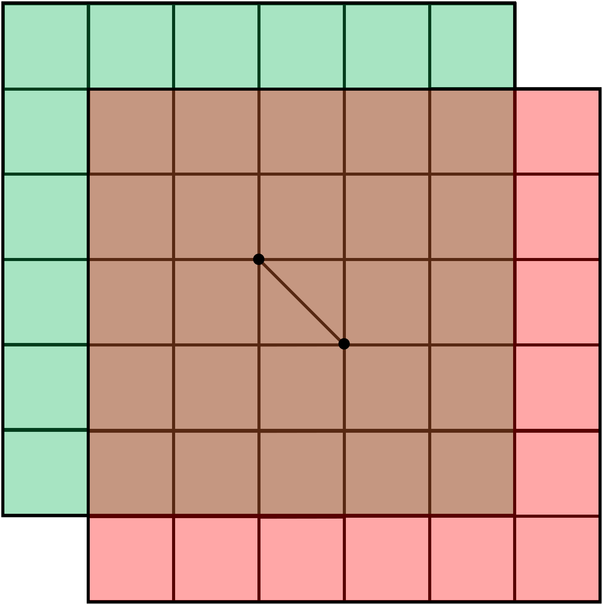
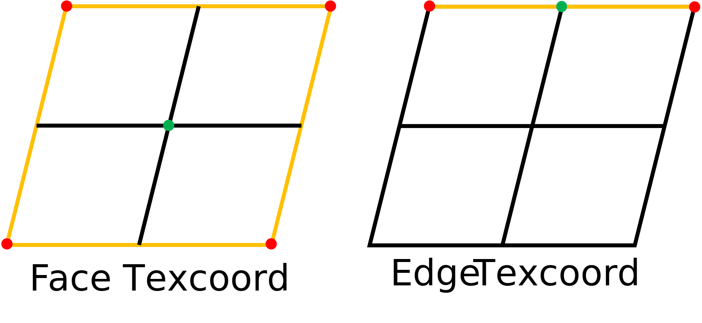
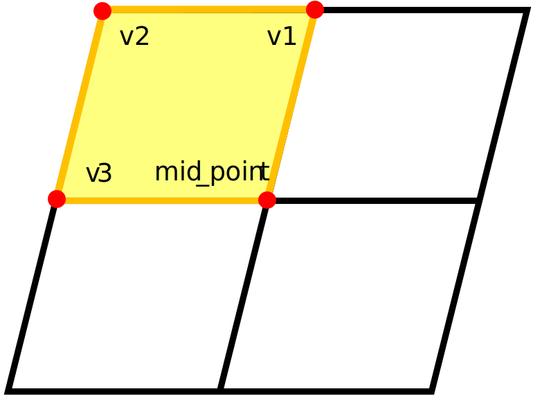
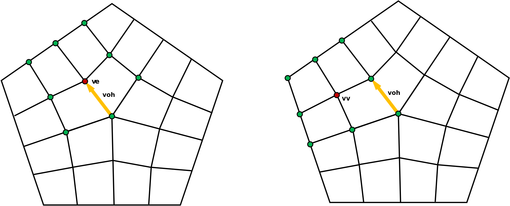

# Preprocessor

This program is a Preprocessor of [Subdivision](https://github.com/UOS-CGLab/Subdivision).


## Contents
- [Overview](#overview)
- [Prerequisites](#prerequisites)
- [Flow of the code](#flow-of-the-code)
  - [Find patches](#find-patches)
  - [Find extraordinary points](#find-extraordinary-points)
  - [Subdivision](#subdivision)
  - [Find limit points](#find-limit-points)


## Overview

This program performs mesh processing and subdivision using OpenMesh. 
It reads a 3D mesh from an .obj file, processes it iteratively to a specified depth of subdivision, 
and generates output files containing subdivision results, extraordinary points, and limit points. 
The program also organizes and compresses the results into a structured output directory.

## Prerequisites

## Flow of the Code


### Find patches

the code for this step is in [get_patch.cpp](https://github.com/UOS-CGLab/preprocessor-cpp/blob/main/src/get_patch.cpp)

This step iterates through all the faces of the mesh, 
checking the following five conditions during each iteration:

1. The face has not been processed yet.
2. The face is not a boundary and has an extraordinary vertex (i.e., valence is not 4). 
3. All neighboring faces also have an extraordinary vertex.
4. If the depth is not 0, all neighboring faces must not be boundaries.
5. The face does not contain any extraordinary vertices.

If all the above conditions are satisfied, meaning that the face is at the center of a patch. 
The code gathers data including vertex indices and texture coordinates of the patch 
and saves it into a file named patch.txt in the output directory.


 


### Find extraordinary points

The code for this step is in [get_extraordinary.cpp](https://github.com/UOS-CGLab/preprocessor-cpp/blob/main/src/get_extraordinary.cpp)

This step iterates through all the vertices of the mesh, 
checking if a vertex has not been processed and is not an extraordinary vertex. 
If it is not extraordinary, the code marks the 3 layers of faces around the vertex to be subdivided.



After checking all the vertices, the code iterates through all faces of the mesh, 
checking if any face contains an extraordinary vertex that is not included in a patch. 
If such a vertex is found, the code writes the face's vertex indices 
and texture coordinates into a file named `extraordinary.txt`

**(This step only works with depth > 0).**


### Subdivision

The code for this step is in [subdivision.cpp](https://github.com/UOS-CGLab/preprocessor-cpp/blob/main/src/subdivision.cpp)

The Catmull-Clark subdivision algorithm is used to subdivide the mesh.

For face and edge texture coordinates, 
the average value of the texture coordinates of the containing vertices is used.



Vertex texture coordinates are the same as the original vertex texture coordinates.

For each subdivided face, texture coordinates are saved as follows:
```cpp
std::vector<OpenMesh::Vec2f> new_tex_coords = {mid_point, v1_texcoord, v2_texcoord, v3_texcoord};
```

 

### Find limit points

The code for this step is in [get_limit_point.cpp](https://github.com/UOS-CGLab/preprocessor-cpp/blob/main/src/get_limit_point.cpp)

The code iterates through all the vertices of the mesh, find the extraordinary vertices(i.e., valence is not 4).

For each extraordinary vertex, the code iterates through the halfedges around the vertex:
```cpp
for (auto voh_it = mesh.voh_iter(*v_it); voh_it.is_valid(); ++voh_it)
```

It finds ____________ 
and saves all the relevant vertices into a file named `limit_point.json`.



